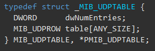
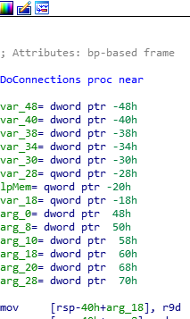
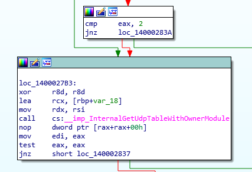

  

## UdpInspector - Getting active UDP connections without sniffing

Many times I've wondered how comes that there are no tools to get active UDP connections.
Of course, you can always sniff with Wireshark or any other tool of your choosing but, why Netstat
doesn't have it built in? That is the point that I went on a quest to investigate the matter.
Naturally, I started with MSDN to read more about what I can get about UDP connections, and that is the moment when I found these
two functions:

- [GetUdpTable](https://docs.microsoft.com/en-us/windows/win32/api/iphlpapi/nf-iphlpapi-getudptable)

- [GetExtendedUdpTable](https://docs.microsoft.com/en-us/windows/win32/api/iphlpapi/nf-iphlpapi-getextendedudptable)

So, I started to look at the struct they return and saw a struct named [MIB_UDPTABLE](https://docs.microsoft.com/en-us/windows/win32/api/udpmib/ns-udpmib-mib_udptable).  

  
Sadly and unsurprisingly it gave no useful information but remember this struct - It will be used in the future. This is when I started to check another
path - Reverse Engineering Netstat.

I will tell you that now - It wasn't helpful at all, but I did learn about a new undocumented function - Always good to know!
When I opened Netstat I searched for the interesting part - How it gets the UDP connections? Maybe it uses a special function that would help me as well.  
  
After locating the area where it calls to get the UDP connections I saw that weird function: InternalGetUdpTableWithOwnerModule.  
  
After a quick check on Google, I saw that it won't help me, there isn't much documentation about it. After I realized that it won't help I went back to the source: The GetExtendedUdpTable function.

After rechecking it I found out that it gives also the PIDs of the processes that communicate in UDP. That is the moment when I understood and built a baseline of
what will be my first step in solving the problem: GetExtendedUdpTable and then get the socket out of the process. But it wasn't enough. 
I needed somehow to iterate and locate the socket that the process holds. After opening process explorer I saw something unusual - I excepted to see something
like \device\udp or \device\tcp but I saw instead a weird \device\afd.
After we duplicated the socket we are one step from the entire solution: What is left is to extract the remote address and port.
Confusingly, the function that needs to use is getsockname and not getpeername - Although the getpeername function theoretically should be used.
Summing up, these are the steps that you need to apply to do it:

- Get all the PIDs that are currently communicating via UDP (via GetExtendedUdpTable)

- Enumerate the PIDs and extract their handles table (NtQueryInformation, NtQueryObject)

- Duplicate the handle to the socket (identified with \Device\Afd)

- Extract from the socket the remote address
