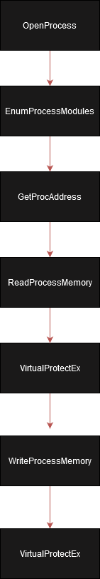

## Introduction
When I first heared about ModuleStomping I was charmed since it wasn't like any other known injection method.<br /><br />
For any other injection method there is something in common: They use VirtualAllocEx to allocate a new space within the process, and
ModulesStomping did something entirelly different: Instead of allocating new space in the process it stomps an existing module that will load
the malicious DLL.<br /><br />
After I saw that I started to think: How can I use that to make an even more evasive change that won't trigger the AV/EDR or won't be found by injection scanner?<br /><br />
The answer was pretty simple: Stomp a single function! At that time I thought that it is a matter of hours to make this work, in the end I know that it took a little more.<br />

## How does a simple injection looks like
For all of the injections you will need to open a process with PROCESS_ALL_ACCESS permission (or a combination of permissions that will allow to spawn thread, write and read the process' memory.) 
since in injections the injector need to perfom high privilege operations such as writing to the memory of the process and execute the shellcode remotely. To be able to get PROCESS_ALL_ACCESS you need either 
to have a high privileged user and running in a high privileged context (You can read more about UAC and what is low privileged and high privileged admin in msdn) or the injected process is a process that you have spawned 
under your process and therefore have all access.<br /><br />
After we obtained a valid handle with the right permissions we need to allocate space to the shellcode within the remote process virtual memory with VirtualAllocEx.
That gives us the space we need and the address for the shellcode to be written. After we have enough space and a page with the right permissions we can use WriteProcessMemory to write the shellcode into the remote process.<br /><br />
Then, all that left is to call CreateRemoteThread with the shellcode's address that we got from the VirtualAllocEx to spawn our shellcode in the other process.<br /><br />
To summerise:<br /><br />
<br /><br />

## Research - How and why FunctionStomping works?
For the sake of the POC I chose to target User32.dll and MessageBoxW. But, unlike the regular way of using GetModuleHandle I needed to do it remotely. For that, I used the EnumProcessModules
function:<br /><br />
<br /><br />
It looks like a very straight forward function and now all I needed to do is to use the good old GetProcAddress. The implementation was pretty simple: Use GetModuleFileName to get the module's name out of the handle
and then if it is the module we seek (currently User32.dll) just use GetProcAddress and get the function's base address.<br /><br />
```cpp
// Getting the module name.
if (GetModuleFileNameEx(procHandle, currentModule, currentModuleName, MAX_PATH - sizeof(wchar_t)) == 0) {
    std::cerr << "[-] Failed to get module name: " << GetLastError() << std::endl;
    continue;
}

// Checking if it is the module we seek.
if (StrStrI(currentModuleName, moduleName) != NULL) {

    functionBase = (BYTE*)GetProcAddress(currentModule, functionName);
    break;
}
```
<br />

But it didn't work. I sat by the computer for quite a while, staring at the valid module handle I got and couldn't figure out why I cannot get the function pointer. At this point, I went back to msdn and read again the description
and one thing caught my eye:<br /><br />
<br /><br />
Well... That explains some things. I searched more about this permission and what it means and found this explanation:<br /><br />
<br /><br />
That was very helpful to me because at this moment I knew why even when I have a valid handle I cannot use GetProcAddress! I decided to change User32.dll and MessageBoxW to other module and function: Kernel32.dll and CreateFileW.<br />
If you are wondering why Kernel32.dll and not other DLL the reason is that Kernel32.dll is always loaded with any file (you can read more about it in the great Windows Internals books) and therefore a reliable target.<br /><br />
And now all that's left is to write the POC.<br /><br />

## POC Development - Final stages
For our final step all we need to do is just like the simple injecton I introduced before but with one significant change: The VirtualAllocEx must be with the base address of our function. Usually in injections we give set the address parameter to NULL and getting back the address that is mapped for us, but since we want to overwrite an existing function we need to give the base address.
After WriteProcessMemory is executed, the function is successfuly stomped!<br /><br />
```cpp
// Changing the protection to PAGE_READWRITE for the shellcode.
if (!VirtualProtectEx(procHandle, functionBase, sizeToWrite, PAGE_READWRITE, &oldPermissions)) {
    std::cerr << "[-] Failed to change protection: " << GetLastError() << std::endl;
    CloseHandle(procHandle);
    return -1;
}

SIZE_T written;

// Writing the shellcode to the remote address.
if (!WriteProcessMemory(procHandle, functionBase, shellcode, sizeof(shellcode), &written)) {
    std::cerr << "[-] Failed to overwrite function: " << GetLastError() << std::endl;
    VirtualProtectEx(procHandle, functionBase, sizeToWrite, oldPermissions, &oldPermissions);
    CloseHandle(procHandle);
    return -1;
}
```
<br />
At first, I used PAGE_EXECUTE_READWRITE permission to execute the shellcode but it is problematic (even due that also with the PAGE_EXECUTE_READWRITE flag anti viruses and hollows-hunter failed to detect it - I wanted to use something else).<br />
Because of that I checked if there is any other permission that can help with what I wanted: To be able to execute the shellcode and still be undetected. You may ask yourself why not just to
use PAGE_EXECUTE_READ?<br />
I wanted to create a single POC and be able to execute any kind of shellcode: Whether it writes to itself or not, and I'm proud to say that I found a solution for that.<br /><br />
I looked more about the avaliable page permissions and one caught my eye: PAGE_EXECUTE_WRITECOPY.<br /><br />
<br />
It looks like it gives read, write and execute permissions without actually use PAGE_EXECUTE_READWRITE. I wanted to dig a little deeper into this and found an article by CyberArk that explains more about this permission and it looked like the fitting solution.<br /><br />
To conclude, the UML of this method looks like that:<br /><br />
<br />

## Detection
Because many anti viruses failed to identify this shellcode injection technique as malicious I added a yara signature I wrote so you can import that to your own defense tools.

## Acknowledgements
<ul>
    <li><a href="https://github.com/countercept/ModuleStomping">ModulesStomping</a> for the insperation of this POC.</li>
    <li><a href="https://www.cyberark.com/resources/threat-research-blog/masking-malicious-memory-artifacts-part-iii-bypassing-defensive-scanners">CyberArk's article</a> for the validation of the further information about WCX permission.</li>
    <li><a href="https://github.com/hasherezade/hollows_hunter">HollowsHunter</a> for the validation that it is undetectable (at the moment).</li>
</ul>